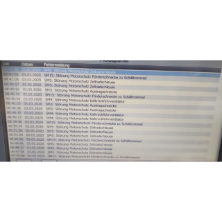

# ioBroker.meldungsliste

## meldungsliste adapter for ioBroker

servicemeldungen Zum anzeigen wichtiger Meldungen oder Fehler die im normalen zustand nicht relevant sind. 

### Getting started

Man gibt an welchen Datenpunkt man haben will und auf welchen wert er reagieren soll.
Danach fügt man in Vis ein "String (unescaped) ein und verknüpft den Datenpunkt.
Es soll helfen Startseiten übersichtlicher zu machen da man nicht sehr viele einzelne Widgets braucht und diese dann absuchen muss nach irgendwelchen zuständen ob diese noch da sind oder nicht.

## Changelog

### 0.0.1
* (thebam) initial release

## License
MIT License

Copyright (c) 2022 thebam <elektrobam@gmx.de>

Permission is hereby granted, free of charge, to any person obtaining a copy
of this software and associated documentation files (the "Software"), to deal
in the Software without restriction, including without limitation the rights
to use, copy, modify, merge, publish, distribute, sublicense, and/or sell
copies of the Software, and to permit persons to whom the Software is
furnished to do so, subject to the following conditions:

The above copyright notice and this permission notice shall be included in all
copies or substantial portions of the Software.

THE SOFTWARE IS PROVIDED "AS IS", WITHOUT WARRANTY OF ANY KIND, EXPRESS OR
IMPLIED, INCLUDING BUT NOT LIMITED TO THE WARRANTIES OF MERCHANTABILITY,
FITNESS FOR A PARTICULAR PURPOSE AND NONINFRINGEMENT. IN NO EVENT SHALL THE
AUTHORS OR COPYRIGHT HOLDERS BE LIABLE FOR ANY CLAIM, DAMAGES OR OTHER
LIABILITY, WHETHER IN AN ACTION OF CONTRACT, TORT OR OTHERWISE, ARISING FROM,
OUT OF OR IN CONNECTION WITH THE SOFTWARE OR THE USE OR OTHER DEALINGS IN THE
SOFTWARE.
